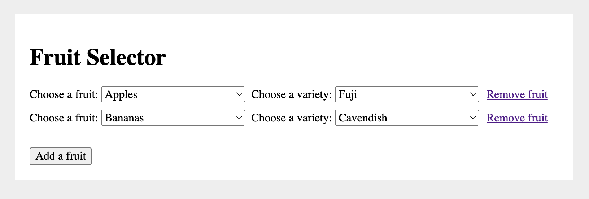

# Interview Task

## Before The Interview

-   Ensure you are using at least Node v14.
-   If you have time, please check out this repository and install using `npm i`
-   You can run the server using `npm run serve` and the site will be visible on [http://localhost:8000/](http://localhost:8000/).
-   Jest tests and Linting can be run using `npm run test`.
-   Cypress test can be run using `npm run test:e2e`.

## During The Interview

Please have a look at the file in `src/data.js`. You will need to use this data to populate the React components.

After you have done this, please look at the following:

1. Edit the existing dropdown so you can select a fruit type
2. Add an extra dropdown beside it so you can select the variety of the selected fruit
3. Add the ability to add extra fruit by adding rows of dropdowns underneath
4. Add the ability to remove a fruit (row of dropdowns)

A rough mock-up of what this might look like is here:

This is a long exercise, you are not expected to complete it all during the interview.
Please ensure that you update the Jest and Cypress tests.
If you have not used React testing Library before this [Cheatsheet](https://testing-library.com/docs/react-testing-library/cheatsheet/) might be helpful.
